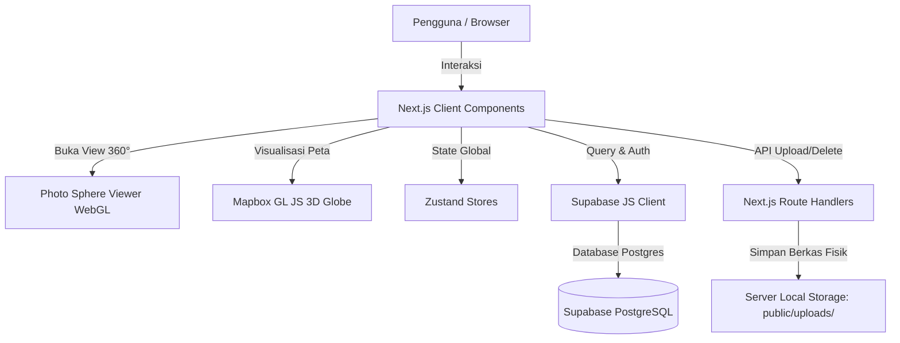

# GeoSpatial Web-GIS System Documentation

Selamat datang di dokumentasi sistem **Web-GIS-main**! Dokumentasi ini dirancang agar Anda dapat memahami seluruh arsitektur proyek, fitur produk (PRD), sistem desain (Design System), struktur data, serta panduan pengembangan untuk melanjutkan proyek ini dengan mudah.

---

## 1. Product Requirements Document (PRD)

### 1.1. Ringkasan Produk
Aplikasi **Web-GIS** ini merupakan platform visualisasi spasial berbasis web interaktif. Sistem ini menggabungkan peta bola dunia 3D (3D Globe) dari Mapbox, tampilan peta mini 2D dari Leaflet, dan penampil gambar panorama 360° (Photo Sphere Viewer) untuk memantau stasiun/node spasial secara real-time.

### 1.2. Pengguna Sistem (User Personas)
Sistem memiliki tiga level akses keamanan:
1. **Public (Guest)**: 
   - Dapat melihat peta dunia 3D beserta titik-titik node yang dipublikasikan (`is_published = true`).
   - Dapat membuka penampil panorama 360° untuk melihat kondisi aktual lapangan secara virtual.
2. **Authenticated User (`role = user`)**:
   - Memiliki semua hak akses publik.
   - Dapat berkontribusi dengan mengunggah gambar panorama 360° baru menggunakan *Smart Uploader*.
   - Tidak dapat mengedit atau menghapus data stasiun yang sudah ada.
3. **Administrator (`role = admin`)**:
   - Memiliki kendali penuh terhadap seluruh sistem.
   - Dapat mempublikasikan, mengedit detail (Nama lokasi, deskripsi, tanggal capture, file gambar), atau menghapus node dari database maupun file fisik lokal.

### 1.3. Fitur Utama & Kebutuhan Fungsional

#### A. 3D Globe Visualization
* **Peta Interaktif**: Menggunakan Mapbox GL JS untuk merender peta bola dunia satelit 3D.
* **Smart Clustering**: Mengelompokkan titik node yang berdekatan secara visual agar peta tetap bersih. Warna cluster berubah dinamis sesuai jumlah data:
  - **Emerald-400**: Cluster kecil (2–9 node)
  - **Violet-400**: Cluster sedang (10–29 node)
  - **Amber-400**: Cluster besar (30–99 node)
  - **Rose-400**: Cluster sangat besar (100+ node)
* **Cinematic Navigation**: Klik pada cluster akan memperbesar peta (*flyTo*) secara halus dengan sudut kemiringan (*pitch*) yang berubah secara dinamis (efek 3D). Klik pada stasiun individual di daftar sidebar akan mengarahkan peta ke koordinat titik tersebut dengan kemiringan 60° (deep zoom).
* **Floating Labels**: Menampilkan label nama stasiun di bawah titik node individual secara real-time pada kanvas Mapbox menggunakan overlay marker HTML kustom.

#### B. 360-Degree Panorama Viewer
* **Equirectangular Rendering**: Menggunakan library Photo Sphere Viewer untuk visualisasi foto 360° secara interaktif (drag, zoom, putar).
* **Adjacent Preloading**: Secara otomatis memuat gambar untuk node berikutnya (*Next*) dan sebelumnya (*Prev*) ke dalam memori latar belakang untuk mempercepat transisi dan meminimalkan jeda pemuatan (latency).
* **Custom Glassmorphism UI**: Menyediakan overlay kontrol custom (Kembali ke peta, informasi tanggal pengambilan gambar, navigasi sebelumnya/berikutnya) di atas penampil 360° tanpa merusak estetika WebGL.

#### C. Smart Photo Uploader (Halaman Admin)
* **Form Drag-and-Drop**: Pengunggah gambar seret-dan-lepas yang mendukung validasi berkas instan.
* **Validasi Format 360°**: Memeriksa aspek rasio berkas gambar (harus mendekati **2:1** atau equirectangular). File ditolak jika tidak sesuai.
* **Auto Metadata Extraction**: Ekstraksi metadata EXIF koordinat GPS (Latitude/Longitude) dan Tanggal Pengambilan Gambar secara otomatis menggunakan library `exifr`. Upload ditolak jika file gambar tidak mengandung koordinat GPS tersemat.
* **Auto Compression**: Mengompres gambar beresolusi tinggi sebelum diunggah (batas maks 5MB, resolusi maks 4096px) menggunakan `browser-image-compression` untuk performa loading yang optimal.
* **Atomic Location Mapping**: Saat menyimpan, sistem secara otomatis menghasilkan slug nama lokasi. Jika lokasi dengan nama/slug tersebut sudah ada di database, node akan dikaitkan ke lokasi tersebut. Jika belum ada, sistem akan membuat entri lokasi baru terlebih dahulu.

---

## 2. Design System

Proyek ini dibangun menggunakan **Tailwind CSS v4** dengan pendekatan estetika modern bertema gelap (*premium dark mode*) dan efek *glassmorphism* untuk menyajikan antarmuka yang elegan dan responsif.

### 2.1. Skema Warna (Design Tokens)

Sistem warna didefinisikan secara langsung di dalam `@theme` Tailwind v4 pada berkas [globals.css](file:///d:/Projek%20Pribadi/webgis/Web-GIS-main/app/globals.css):

| Token Warna | Nilai Heksadesimal / RGBA | Representasi & Penggunaan |
| :--- | :--- | :--- |
| `--color-background` | `#030712` | Warna latar belakang utama (Slate 950) |
| `--color-foreground` | `#f1f5f9` | Warna teks utama |
| `--color-surface` | `rgba(0, 0, 0, 0.40)` | Permukaan dasar komponen semi-transparan |
| `--color-surface-hover` | `rgba(255, 255, 255, 0.05)` | Status hover permukaan komponen |
| `--color-border-glass` | `rgba(255, 255, 255, 0.10)` | Garis tepi komponen glassmorphism standar |
| `--color-accent-cyan` | `#22d3ee` | Warna aksen utama (Cyan 400) untuk status aktif, tombol, & spinner |
| `--color-accent-violet`| `#a78bfa` | Warna aksen sekunder (Violet 400) |
| `--color-accent-pink`  | `#f472b6` | Warna aksen tambahan (Pink 400) |
| `--color-text-primary` | `#f1f5f9` | Teks utama |
| `--color-text-secondary`| `#94a3b8` | Teks pendukung / deskripsi (Slate 400) |
| `--color-text-muted`    | `#64748b` | Teks non-aktif / keterangan tambahan (Slate 500) |

### 2.2. Tipografi
* **Font Keluarga**: Menggunakan font **Inter** (`var(--font-inter)`) yang berkarakter modern dan bersih sebagai font sans-serif utama.
* **Skala Teks**: Memanfaatkan ukuran teks standar Tailwind dari `text-xs` (untuk metadata) hingga `text-3xl` (angka statistik di sidebar).

### 2.3. Glassmorphism Utilities
Komponen antarmuka overlay di atas peta satelit menggunakan utilitas CSS blur saturasi tinggi:

```css
/* Definisian utility pada globals.css */
@utility glass-panel {
  background: rgba(15, 23, 42, 0.75);
  backdrop-filter: blur(24px) saturate(2.0);
  -webkit-backdrop-filter: blur(24px) saturate(2.0);
  border: 1px solid rgba(255, 255, 255, 0.15);
  border-radius: 1rem;
}

@utility glass-card {
  background: rgba(15, 23, 42, 0.85);
  backdrop-filter: blur(24px) saturate(2.0);
  -webkit-backdrop-filter: blur(24px) saturate(2.0);
  border: 1px solid rgba(255, 255, 255, 0.15);
  border-radius: 0.75rem;
}

@utility glass-button {
  background: rgba(15, 23, 42, 0.85);
  backdrop-filter: blur(24px) saturate(2.0);
  -webkit-backdrop-filter: blur(24px) saturate(2.0);
  border: 1px solid rgba(255, 255, 255, 0.25);
  border-radius: 0.5rem;
  transition: all 0.2s ease;
  cursor: pointer;

  &:hover {
    background: rgba(15, 23, 42, 0.95);
    border-color: rgba(255, 255, 255, 0.40);
  }
}
```

### 2.4. Animasi & Mikro-interaksi
Untuk memberikan kesan antarmuka yang responsif, terdapat beberapa utility keyframe animasi bawaan:
* `animate-fade-in`: Masuk membesar secara halus menggunakan kurva easing `cubic-bezier(0.16, 1, 0.3, 1)`.
* `animate-slide-up`: Bergeser ke atas perlahan saat komponen dimuat.
* `animate-pulse-glow`: Efek denyut lampu indikator stasiun online.

---

## 3. Arsitektur Teknis & Struktur Data

Sistem ini dibangun di atas tumpukan teknologi modern Next.js 16 (App Router), React 19, TypeScript, database Supabase, dan penyimpanan file lokal.



### 3.1. Skema Database (PostgreSQL)

Proyek menggunakan Supabase PostgreSQL dengan konfigurasi RLS (Row Level Security) yang ketat. Skema tabel didefinisikan sebagai berikut:

#### 1. Tabel `user_roles`
Menyimpan peran akses dari pengguna yang terdaftar di `auth.users`.
* `user_id` (UUID, PK): Menghubungkan ke `auth.users(id)`.
* `role` (user_role_type enum): Bernilai `'admin'` atau `'user'`.

#### 2. Tabel `locations`
Menyimpan data grup lokasi untuk pengelompokan stasiun.
* `id` (UUID, PK, Default: `gen_random_uuid()`)
* `name` (TEXT): Nama lokasi (misal: "Stasiun Meteorologi A").
* `slug` (TEXT, Unique): Slug url-friendly dari nama lokasi.
* `description` (TEXT): Deskripsi/Section stasiun.
* `created_at` (TIMESTAMPTZ, Default: `now()`)

#### 3. Tabel `spatial_nodes`
Menyimpan informasi spasial spesifik stasiun dan berkas panoramanya.
* `id` (UUID, PK, Default: `gen_random_uuid()`)
* `location_id` (UUID, FK): Menghubungkan ke tabel `locations(id)`.
* `longitude` (FLOAT8)
* `latitude` (FLOAT8)
* `image_url` (TEXT): Alamat path lokal (misal: `/uploads/1720950345_pan.jpg`).
* `is_published` (BOOLEAN, Default: `false`)
* `capture_date` (DATE): Tanggal pemotretan panorama.
* `created_at` (TIMESTAMPTZ, Default: `now()`)

### 3.2. Kebijakan Keamanan database (RLS Policies)
* **Locations Table**: 
  - Publik (`public`) diizinkan untuk membaca seluruh data (`SELECT`).
  - Pengguna terautentikasi (`authenticated` & `role = 'user'`) diizinkan menambah data (`INSERT`).
  - Administrator (`role = 'admin'`) memiliki izin penuh (`ALL` - Insert, Update, Delete, Select).
* **Spatial Nodes Table**:
  - Publik hanya diizinkan membaca data stasiun yang dipublikasikan (`SELECT` jika `is_published = true`).
  - Pengguna terautentikasi (`authenticated` & `role = 'user'`) diizinkan menambah data (`INSERT`).
  - Administrator memiliki izin penuh (`ALL`).

### 3.3. Struktur Folder Proyek
Berikut adalah peta struktur direktori utama:

```text
├── .agents/                 # File instruksi AI Agent & kustomisasi
├── app/                     # Next.js App Router
│   ├── api/                 # Endpoint API
│   │   ├── dashboard/       # Endpoint utilitas dashboard admin
│   │   ├── upload/          # Unggah gambar fisik ke server lokal
│   │   └── seed/            # Seeding data awal database
│   ├── dashboard/           # Halaman Admin Dashboard
│   │   ├── login/           # Halaman Login Admin/User
│   │   ├── users/           # Halaman manajemen user (Admin)
│   │   └── page.tsx         # Dashboard utama (tabel edit & hapus data)
│   ├── globals.css          # Desain global & theme tokens (Tailwind v4)
│   ├── layout.tsx           # Layout dasar aplikasi
│   └── page.tsx             # Halaman visualisasi spasial 3D utama (Globe + 360 Viewer)
├── components/              # Komponen React reusable
│   ├── admin/               # Komponen administrasi (SmartUploader)
│   ├── auth/                # Komponen autentikasi (LogoutButton)
│   ├── map/                 # Peta 3D Mapbox (MapboxGlobe)
│   ├── modal/               # Komponen pop-up detail (ViewerModal, LeafletMiniMap)
│   └── ui/                  # Komponen antarmuka (DashboardShell, MapSidebar, ThemeToggle)
├── hooks/                   # Custom Hooks (useMapbox.ts mengontrol siklus hidup Mapbox)
├── lib/                     # Konstanta & Data tipe spasial
├── public/                  # File statis
│   └── uploads/             # Direktori penyimpanan lokal berkas panorama 360° yang diunggah
├── store/                   # Zustand global state (useMapStore, useDashboardStore)
├── supabase/                # SQL Migrations schema
├── utils/                   # Utilitas (Client & Server helper untuk integrasi Supabase SSR)
├── next-env.d.ts            # Ambient declarations tipe Next.js
├── tsconfig.json            # Konfigurasi TypeScript compiler
└── package.json             # Modul dependensi node.js
```

---

## 4. Panduan Memulai & Pengembangan

### 4.1. Persyaratan Awal (Prerequisites)
Pastikan lingkungan Anda terinstal:
* **Node.js**: Versi `>= 20.9.0`
* **NPM**: Pengelola paket bawaan Node.js
* **Supabase Project**: Akun & database aktif di Supabase

### 4.2. Pengaturan Lingkungan (Local Environment Setup)
1. Salin file `.env.example` menjadi `.env` di direktori utama.
2. Lengkapi variabel berikut dengan kredensial Supabase dan Mapbox Anda:
   ```env
   NEXT_PUBLIC_SUPABASE_URL=https://your-project.supabase.co
   NEXT_PUBLIC_SUPABASE_ANON_KEY=your-anon-key
   SUPABASE_SERVICE_ROLE_KEY=your-service-role-key (untuk admin)
   NEXT_PUBLIC_MAPBOX_ACCESS_TOKEN=your-mapbox-token
   ```

### 4.3. Menjalankan Server Lokal
Instal modul node dan jalankan server pengembangan:
```bash
npm install
npm run dev
```
Aplikasi akan aktif secara lokal di `http://localhost:3000`.

### 4.4. Panduan Penambahan Fitur Selanjutnya
* **Optimalisasi WebGL**: Peta Mapbox GL JS dan Photo Sphere Viewer memakan memori WebGL yang cukup besar. Pastikan untuk selalu membersihkan instans peta pada fungsi cleanup React (`map.remove()`, `viewer.destroy()`) untuk mencegah kebocoran memori (*memory leaks*), yang saat ini sudah diimplementasikan di `useMapbox.ts` dan `Viewer360.tsx`.
* **Migrasi Penyimpanan**: Jika aplikasi akan di-deploy ke production (misalnya Vercel), fungsi upload lokal di `/api/upload` harus dialihkan menggunakan **Supabase Storage Bucket** karena server serverless Vercel bersifat *read-only* / temporer.

---

*Dokumentasi ini dibuat untuk memandu Anda melanjutkan pengembangan proyek Web-GIS secara berkelanjutan. Jika Anda memiliki pertanyaan atau ingin menambahkan fitur baru, silakan lakukan perubahan terstruktur sesuai dengan Design System dan arsitektur database di atas!*
